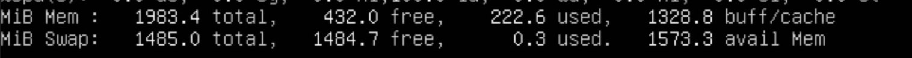

## Операционные системы UNIX/Linux (Базовый).

## Part 1. Установка ОС.
* Устанавливаем [Ubuntu-20.04-Server-LTS](https://old-releases.ubuntu.com/releases/20.04.0/ubuntu-20.04-live-server-amd64.iso) , [инструкция](https://linuxconfig.org/how-to-install-ubuntu-20-04-on-virtualbox) в VirtualBox и проверяем установленную версию командой:

  `cat /etc/issue` ;

## Part 2. Создание пользователя.

* 1. Cоздаем пользователя командой: 

 `sudo adduser (username)` ;        

 
 [Более подробная информация по утилите adduser](https://www.opennet.ru/man.shtml?topic=adduser&category=8&russian=0)
* 2.  Создаем друппу adm и добавляем права для пользователя с помощью команды: 

  `sudo groupadd adm` ;
  `sudo usermod -a -G adm roma` ;

[Более подробная информация по утилите useradd](https://www.opennet.ru/man.shtml?topic=useradd&category=8&russian=0).

* 3. Проверяем правильность выполненных действий командой:

  `cat /etc/passwd` ;

## Part 3. Настройка сети ОС.

* 1. Задаём название машины:

  `sudo hostnamectl set-hostname user-1` ;

* 2. Задаем время, нам нужно Московское, для этого выбираем Европу, затем Россию, затем Москву и подтверждаем:

  `tzselect` ;

* Способ 2:
  `sudo timedatectl set-timezone Europe/Moscow` ;

* 3. Выясняем внешний **ip-адрес** , **ip-адрес** устройства , внутренний **ip-адрес** шлюза(**gw**) , а также выводим названия сетевых интерфейсов.
* Адрес устройства:

  ` hostname -I ` ;
     
   

* Внешний адрес:
 ` curl 2ip.ru ` ;

   

* gw:
`ip r | grep def | grep -Eo '[0-9.]*' | head -n 1`;

   

* Названия сетевых интерфейсов:
` ifconfig ` ;

  

         

* 4. Ликбез по сетевым интерфейсам.

* **lo** - интерфейс обратной петли (loopback) позволяет компьютеру обращатся к самому себе. Интерфейс имеет ip-адрес 127.0.0.1 и может быть использован сетевым клиентским программным обеспечением, чтобы общаться с серверным приложением, расположенным на том же компьютере.
 * **DHCP (Dynamic Host Configuration Protocol)** — протокол прикладного уровня модели TCP/IP, служит для автоматизации назначения IP-адреса клиенту. Сервер всегда слушает 67 порт, ожидает широковещательное сообщение от клиента, а после его получения отправляет ответное предложение — DHCPOFFER. Клиент принимает сообщение на 68 порту.

*  Задаем статичные настройки **ip, gw, dns** в файле конфигурации netplan:

* Сперва вводим команду:

  ` nano /etc/netplan/*.yaml `;

* Откроется nano туда вставляем следующий текст для изменения сетевых конфигураций на нужные нам:

 

* Подтверждаем конфигурации:

  `sudo netplan apply`;

* Перезагружаем машину:

  `shutdown -r now`;

* Пингуем `1.1.1.1` и `ya.ru`:

 

## Part 4. Обновление ОС.

* Начинаем процесс обновления командой `sudo apt-get update` для обновления информации о пакетах, далее `sudo apt-get dist-upgrade` для продвинутого механизма разрешения конфликтов;

## Part 5. Использование команды sudo.

* Команда **sudo** ( substitute user and do, подменить пользователя и выполнить ) позволяет строго определенным пользователям выполнять указанные программы с административными привилегиями без ввода пароля суперпользователя root.

* Пользователю **roma**, выдадим привелегии: `sudo usermod -aG sudo roma`;

* Вводим команду: `su - roma`, чтобы перейти на учетную запись **roma**;

* Cменим название хоста командой: `sudo -u roma sudo hostnamectl set-hostname user-2` ;

* Проверим командой `hostname`, получилось ли?

## Part 6. Установка и настройка службы времени.

* Вообще дату и время мы установили еще в **Part 2** , но давайте проверим правильность установленного времени с помощью команд:

`date;
 timedatectl show;`

## Part 7. Установка и использование текстовых редакторов.
* Основная цель задания - Установить текстовые редакторы VIM (+ любые два по желанию NANO, MCEDIT, JOE и т.д.)
Используя каждый из трех выбранных редакторов, создайте файл test_X.txt, где X -- название редактора, в котором создан файл. Напишите в нём свой никнейм, закройте файл с сохранением изменений.

* 1. NANO:
  * `nano test_nano.txt`;
  * Введите свой ник (**nikimade**);
  * Нажмите **Cmd+O**, **Enter** для сохранения и **Cmd+X** для выхода;
  

  * Нажимте **Cmd+\\**, введите строку, которую необходимо искать (**nikimade**) и нажмите клавишу **Enter**. Затем введите строку, на которую произвести замену (**21 School 21**) и нажмите **Enter**; 
  

  * нажмите клавишу **A** для замены всех вхождений строки;
  

  * Нажмите **Cmd+X** для выхода;
  * Нажмите **N** для выхода без сохранения изменений;

* 2. Vim:
  * `vim test_vim.txt`;
  * Введите свой ник (**nikimade**). Для этого нужно перейти в режим редактирования путем нажания клавиши **i**;

  * Для выхода с сохранением нажмите **ESC** , затем введите **:wq**. Для подтверждения нажмите **Enter**;
  

  * Для замены (**nikimade**) на (**21 School 21**) в **vim** -  **ESC** **:%s/слово/замена слово**;
  

  * Для выхода без сохранения нажимаем **ESC** , **SHIFT + вводим q!**. Для подтверждения нажмите **Enter**;

* 3. MCEDIT:
  * Устанавливаем MCEDIT `sudo apt-get install mcedit`;
  * `mcedit test_mcedit.txt`;
  * Введите свй ник (**nikimade**);
  * Для сохранения нажмите **F2(save)** , затем нажмите **F10exit** для выхода
  

  * Меняем (**nikimade**) на (**21 School 21**);
   
  

  * Для выхода без сохранения нажмите **F10** , затем перевидите указатель на **NO**. Для подтверждения нажмите **Enter**;
  

## Part 8. Установка и базовая настройка сервиса SSHD.
* Устанавливаем и настраиваем SSH-сервер с помощью команд:

      `sudo apt-get install openssh-server net-tools && 
      sudo systemctl enable ssh &&  # добавляем сервер в автозапуск
      sudo sed -i '/Port/c\Port 2022' /etc/ssh/sshd_config &&  # изменяем порт
      sudo systemctl restart sshd;
      clear;`

      

## Part 9. Установка и использование утилит top, htop.
* По выводу команды top определить и написать в отчёте:

* uptime: top - 14:19:44 up 2:27
     
* количество авторизованных пользователей: 1 user
     
* общую загрузку системы: 0.14, 0.22, 0.09
   
* общее количество процессов: 105 total, 1 running, 104 sleeping
     
* загрузку cpu: 0.0 us, 0.0 sy, 0.0ni, 100.0 id, 0.0 wa, 0.0 hi, 0.0 si, 0.0 st
     
* загрузку памяти:

     
* pid процесса занимающего больше всего памяти:
   

* pid процесса, занимающего больше всего процессорного времени:
 

* Вывод htop по отсортированным **PID**,**PERCENT_CPU**,**PERCENT_MEM**, **TIME** . 
* Сортируем с помощью команды ` htop -s " "`.

* PID:

* PERCENT_CPU:
 

* PERCENT_MEM:
 

* TIME:
 

* отфильтрованному для процесса sshd:
Нажмите **F4** - для того, чтобы на шаг стать ближе к завершению нужного действия, после запуска **htop**.
 

* с процессом syslog, найденным, используя поиск:
Нажмите **F3** - для того, чтобы на шаг стать ближе к завершению нужного действия, после запуска **htop**.
 

* с добавленным выводом hostname, clock и uptime:
Нажмите **F2** - для того, чтобы на шаг стать ближе к завершению нужного действия, после запуска **htop**.
 

## Part 10. Использование утилиты fdisk.

* Запустить команду `sudo fdisk -l`.

**В отчёте написать название жесткого диска, его размер и количество секторов, а также размер swap.**

* Полное название жесткого диска: 
    * Общее название: **Disk /dev/sda**
    * Disk model: **VBOX**
    * Disk identifier: **4912CCCB3-O8C2-4F48-BE5D-FFC67167DF81** ;

* Размер жесткого диска: **8.25GB**;
* количество секторов: **17293312 sectors**;
* размер swap **1.4 GB**
* Размер swap так же можно узнать с помощью `free -h`
 

## Part 11. Использование утилиты df.
*   **Запускаем команду df**;
Прописываем ` /` через пробел, для того, чтобы попасть в корневой раздел;
** размер раздела: **8408452 KB**;
* размер занятого пространства: **4562496 KB**;
* размер свободного пространства: **3397240 KB**;
* процент использования: **58%**;

  

**Запустить команду df -Th.**;
Прописываем ` /` через пробел, для того, чтобы попасть в корневой раздел;

* размер раздела: **8,1 G**;
* размер занятого пространства: **4,4 G**;
* размер свободного пространства: **3,3 G**;
* процент использования: **58%**;
* тип файловой системы: **ext4**;

 

## Part 12. Использование утилиты du.

* Нужно вывести размер папок /home, /var, /var/log (в байтах, в человекочитаемом виде) с помощью **du**;

* Для этого вводим команду `sudo du -hs -B KB /"путь к папке"`;

* /home:
* /var:
* /var/log:

* Вывести размер всего содержимого в /var/log (не общее, а каждого вложенного элемента, используя *):

## Part 13. Установка и использование утилиты ncdu.

* Установить утилиту ncdu. `sudo apt install ncdu`.
* Вывести размер папок /home, /var, /var/log.

* /home:

* /var:

* /var/log:

## Part 14. Работа с системными журналами.

* Написать в отчёте время последней успешной авторизации, имя пользователя и метод входа в систему.

* Устанавливаем **lnav** c помощью команды `sudo apt-get install lnav -y` .

* Проверяем последний вход командой `last -1`.

* С помощью команды **lnav** смотрим следующие логи:

* 1. /var/log/dmesg:

* 2. /var/log/syslog:

* 3. /var/log/auth.log:

Открыв **/var/log/auth.log** становится ясно, что последняя успешная авторизация - yuria в 16:51:48.

* Перезапустить службу SSHd.
`sudo systemctl restart ssh`;

* Скриншот после перезагрузки.

## Part 15. Использование планировщика заданий CRON.

* Используя планировщик заданий, запустите команду uptime через каждые 2 минуты.
* Вводим команду `crontab -e`
Затем задаем **uptime** каждые 2 минуты:

* Найти в системных журналах строчки (минимум две в заданном временном диапазоне) о выполнении:

* Для вывода списка текущих заданий **CRON** используем команду `crontab -l`:

* Удалите все задания из планировщика заданий командой `crontab -r` и проверим с помощью `crontab -l`:

